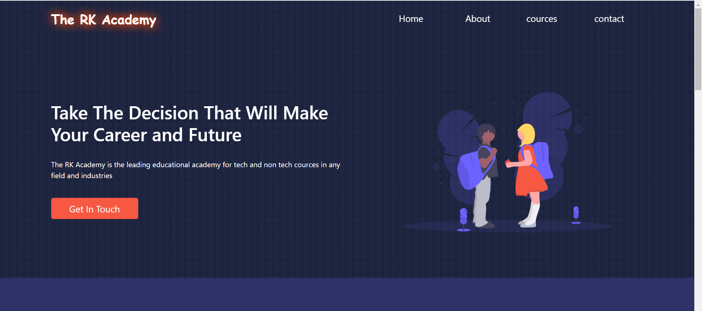
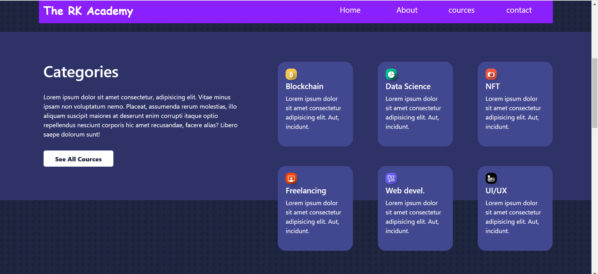
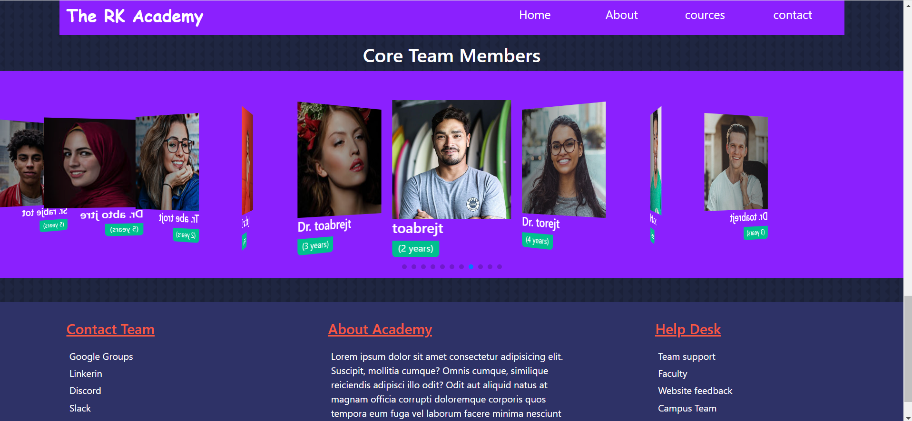

# [The Rk Academy](https://the-rk-academy.netlify.app/) - A Website For Educational Organization

## Project Overview

This website introduces the different courses, Team members, information with great interactive UI cards.

Users can send mail to us directly from the website, by filling up details and messages with CAPTCHA verification.

This website is responsive on all devices using the Bootstrap grid system.

Library used: swiperjs (for 3D card slidess)

## Screenshots Of Project

